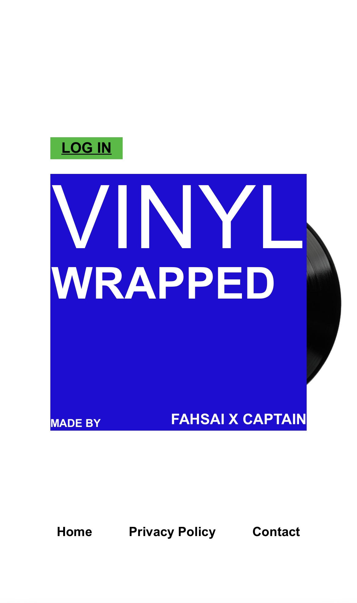
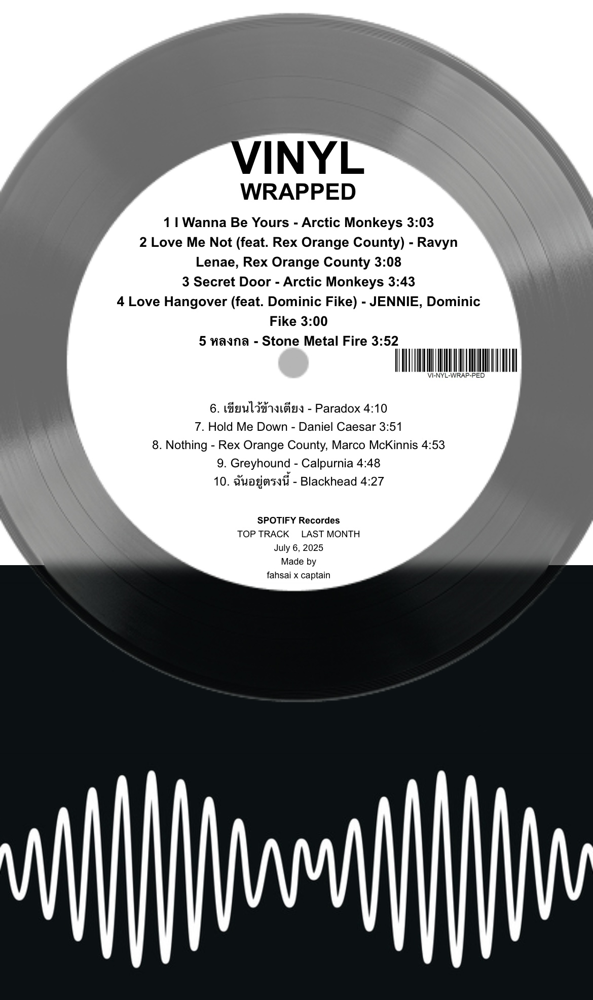
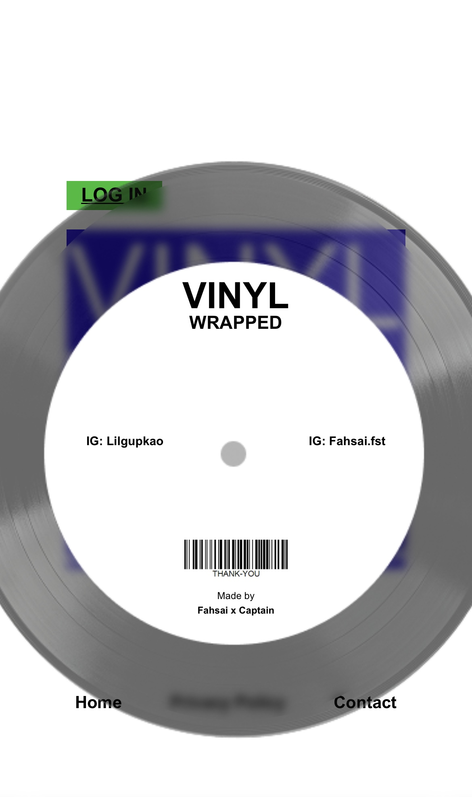
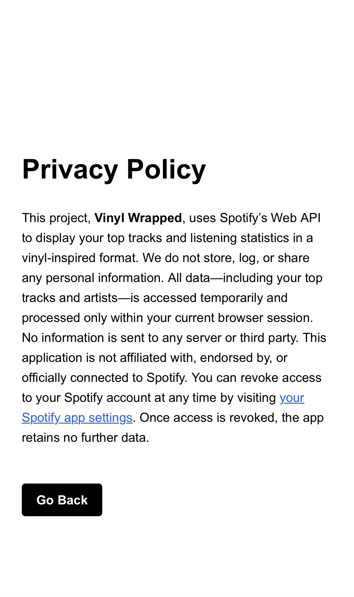

# Vinyl Wrapped — Spotify Top Tracks

A web application that displays your **top Spotify tracks** in a vinyl-inspired design.  Built with **Next.js (frontend)** and **Express.js (backend)**, integrated with **Spotify Web API**. This project replicates the concept of *Spotify Wrapped*, allowing users to view and export their favorite tracks.


> ⚠️ This app is not affiliated with Spotify AB.


## Features

- Spotify OAuth2 Login
- Fetch user’s top tracks via Spotify API
- Vinyl-style UI with card design
- Export design as image using `html2canvas`
- Refresh token handling


## Tech Stack

| Layer      | Technology                |
|------------|----------------------------|
| Frontend   | [Next.js 14+](https://nextjs.org/) + TypeScript |
| Styling    | CSS + Tailwind (partially) |
| Backend    | [Express.js](https://expressjs.com/) |
| API Auth   | [Spotify Web API](https://developer.spotify.com/documentation/web-api) |
| Image      | [html2canvas](https://www.npmjs.com/package/html2canvas) |


## Preview

<p align="center">
  
  
  
  
</p>


## Getting Started

### 1. Clone the repository

```bash
git clone https://github.com/YOUR_USERNAME/vinyl-wrapped.git
cd vinyl-wrapped
```


### 2. Install dependencies

Frontend

```bash
cd client
npm install
```

Backend

```bash
cd server
npm install
```

### 3. Setup Environment Variables

Create a .env file in the server/ directory:

```bash
SPOTIFY_CLIENT_ID=your_spotify_client_id
SPOTIFY_CLIENT_SECRET=your_spotify_client_secret
REDIRECT_URI=http://localhost:3001/callback
```

> Ensure that REDIRECT_URI matches the one registered on Spotify Developer Dashboard.

### 4. Run Locally

Frontend

```bash
cd client
npm install
npm run dev
```

Backend

```bash
cd server
npm install
node index.js
```

## License

This project is for learning/demo purposes only.
No copyright infringement intended.

